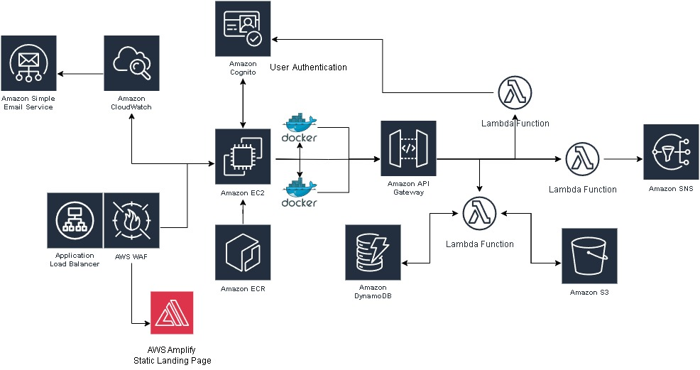

# Streamlit Application on AWS

This is a web application project that was developed using Streamlit. The purpose of this project is to build a web application using Azure Cloud services for most backend services.

The application uses the following AWS services:
- S3 Bucket
- API Gateway
- DynamoDB - Backend Database
- API Gateway
- AWS Cognito
- IAM
- EC2 (EC2 Instance)
- Lambda Functions
- CloudWatch
- SNS

## Architecture Diagram:

